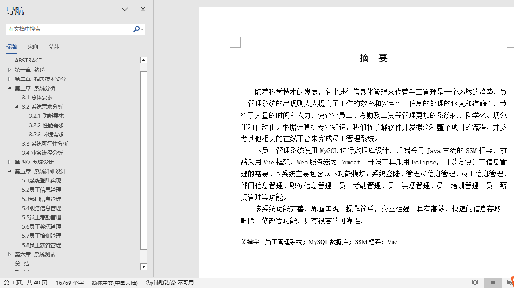
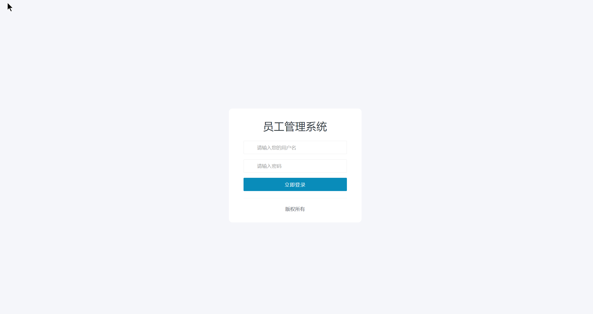

## 基于SSM的员工管理系统(程序+报告)

- <b>完整代码获取地址：从戎源码网 ([https://armycodes.com/](https://armycodes.com/))</b>
- <b>技术探讨、资料分享，请加QQ群：692619798</b> 
- <b>作者微信：19941326836  QQ：952045282</b> 
- <b>承接计算机毕业设计、Java毕业设计、Python毕业设计、深度学习、机器学习</b>
- <b>选题+开题报告+任务书+程序定制+安装调试+论文+答辩ppt 一条龙服务</b>
- <b>所有选题地址 ([https://github.com/YuLin-Coder/AllProjectCatalog](https://github.com/YuLin-Coder/AllProjectCatalog)) </b>

## 项目介绍
基于SSM的员工管理系统，本员工管理系统主要包含以下功能模块：
1.系统功能
系统登陆、修改密码、退出
2.管理员信息管理
管理员列表、添加管理员、修改管理员、删除管理员、批量删除
等
3.员工信息管理
员工列表、添加员工、修改员工、删除员工、批量删除等
4.部门信息管理
部门列表、添加部门、修改部门、删除部门、批量删除等
5.职务信息管理
职务列表、添加职务、修改职务、删除职务、批量删除等
6.员工考勤管理
员工考勤列表、添加员工考勤、修改员工考勤、删除员工考勤、
批量删除等7.员工奖惩管理
员工奖惩列表、添加员工奖惩、修改员工奖惩、删除员工奖惩、
批量删除等
8.员工培训管理
员工培训列表、添加员工培训、修改员工培训、删除员工培训、
批量删除等
9.员工薪资管理
员工薪资列表、添加员工薪资、修改员工薪资、删除员工薪资、
批量删除等

## 项目技术
- 编程语言：Java
- 数据库：MySQL
- 前端技术：Layui、Vue
- 后端技术：Spring、SpringMVC、MyBatis

## 运行环境
- JDK版本：JDK1.8及以上
- 开发工具：IDEA、Ecplise、Myecplise都可以
- 数据库: MySQL5.7及以上

## 运行截图

